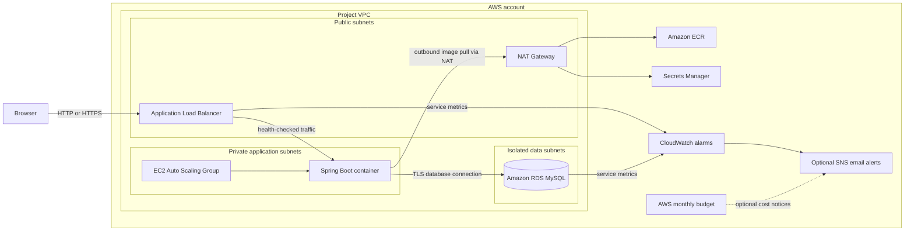
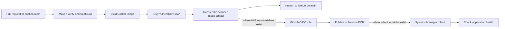

# Access Portal on AWS

A hands-on DevOps portfolio project: a secure Java access portal packaged in Docker and delivered through an AWS three-tier architecture. The application, infrastructure, and delivery workflows are developed for this repository and expanded incrementally.

> **Project status:** The application and CI workflow are implemented. Terraform describes the AWS deployment; creating AWS resources and configuring account-specific values are operator steps. See [deployment notes](infra/terraform/README.md) before applying anything.

[Architecture](#architecture) · [Features](#what-it-demonstrates) · [Run locally](#run-locally) · [CI-and-delivery](#build-scan-and-delivery) · [AWS deployment](#aws-deployment) · [Project layout](#project-layout)

## Project origin

The current application and delivery platform are an independent implementation built for this project. The learning direction came from a public Java login and AWS three-tier exercise: [Java login and AWS exercise](https://github.com/NotHarshhaa/DevOps-Projects/tree/master/DevOps-Project-01). The original application code is not part of the current implementation.

## Architecture

### Application and AWS environment



The Terraform defaults keep the application Auto Scaling Group at zero until the database application user and secret are configured. The load balancer and database can still incur charges when the app group is empty.

### Build, scan, and release



The workflow publishes only after verification and image scanning pass. The exact scanned image artifact is carried into publishing. ECR publishing uses short-lived GitHub OIDC credentials; no long-lived AWS access key is stored in GitHub.

## What it demonstrates

| Area | Implementation |
| --- | --- |
| Application | Java 21, Spring Boot, Spring Security, JDBC, Flyway, MySQL |
| Security | BCrypt password hashing, environment-based configuration, least-privilege AWS roles, private subnets, IMDSv2 |
| Containers | Multi-stage Docker build, non-root runtime, read-only local container configuration |
| CI and image security | GitHub Actions, Maven, SpotBugs, Trivy, GHCR, Amazon ECR |
| Infrastructure as code | Terraform modules for networking, security, application, database, release, and monitoring |
| AWS operations | GitHub OIDC, Systems Manager, CloudWatch alarms, SNS notifications, AWS Budgets, ECR lifecycle policy |

## Run locally

### Requirements

- JDK 21
- Maven 3.9 or newer
- Docker Desktop with Docker Compose
- Bash (Git Bash works on Windows)

From the repository root:

```bash
cp .env.example .env
```

Edit `.env` and set unique local passwords. Then start MySQL and the application:

```bash
bash scripts/run-local.sh
```

Open [http://localhost:8080](http://localhost:8080), register a test account, and sign in. The script starts MySQL through Compose and runs the app with Maven. Local database data persists in a Docker volume.

Stop the app with `Ctrl+C`, then stop MySQL:

```bash
docker compose down
```

To also remove the local database volume and its data, run `docker compose down --volumes`.

### Run the container image

With `.env` configured, start the app and database as containers:

```bash
docker compose --profile container up --build
```

Both services bind to localhost. The app container runs without root, drops Linux capabilities, and uses a read-only filesystem.

### Scan the image locally

Install Trivy, build the image, and scan for HIGH and CRITICAL vulnerabilities:

```bash
docker compose --profile container build access-portal
bash scripts/scan-image.sh
```

The scan exits unsuccessfully when it finds a matching vulnerability. See the [Trivy installation guide](https://trivy.dev/latest/getting-started/installation/).

More application commands and notes are in [app/README.md](app/README.md).

## Build, scan, and delivery

The workflow in [`.github/workflows/ci.yml`](.github/workflows/ci.yml) runs Maven verification and SpotBugs, builds the container, and scans it with Trivy for pull requests to `main` and pushes to `main`.

- On pushes to `main`, it publishes the scanned image to GHCR with a commit SHA tag and `latest`.
- If the AWS repository variables are configured, it also publishes to ECR using GitHub OIDC.
- If the SSM rollout variables are configured, it restarts running application instances one at a time and waits for health checks.

The current application does not yet have an automated test suite. Maven runs the test lifecycle, but test coverage should not be claimed until focused tests are added.

## AWS deployment

Terraform source is in [`infra/terraform`](infra/terraform), with setup, account configuration, cost notes, monitoring, and teardown instructions in its [deployment guide](infra/terraform/README.md).

Before applying infrastructure, review the plan and cost estimate. NAT Gateway, load balancer, RDS, CloudWatch alarms, and public IPv4 charges may apply. The sample configuration keeps the app group at zero; do not scale it up until the application database user and secret are ready. The default demo database is deleted without a final snapshot on destroy.

## Project layout

```text
app/                    Spring Boot application and Dockerfile
infra/terraform/        Modular AWS infrastructure and deployment guide
scripts/                Local development and Trivy scan helpers
.github/workflows/      CI, image scanning, publishing, and rollout
compose.yaml            Local MySQL and container environment
docs/                   Portfolio evidence checklist
```

## Portfolio evidence

The [evidence checklist](docs/portfolio-evidence.md) describes useful screenshots to capture after a real deployment and what to redact. It distinguishes implemented configuration from resources that have actually been deployed.

## Security

Never commit `.env`, AWS credentials, database passwords, access tokens, Terraform state, or generated environment files. Use test credentials locally. Do not enter real credentials through the HTTP-only demo endpoint; configure HTTPS before exposing the application for real use.
