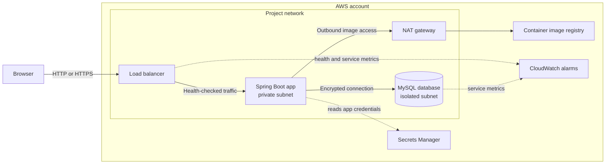
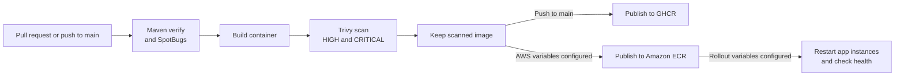

# Access Portal on AWS

A small Java sign-in application packaged with Docker and supported by a Terraform AWS foundation. This repository shows how an application can move from local development through image scanning and, when configured, into AWS.

> **Current state:** The application and GitHub Actions workflow are implemented. Terraform describes the AWS environment; AWS resources are created only when an operator configures and applies it. The default Auto Scaling Group starts with **zero instances**.

| Start here | |
|---|---|
| Try the app locally | [Run locally](#run-locally) |
| Understand the system | [How it fits together](#how-it-fits-together) |
| Deploy to AWS | [AWS deployment guide](infra/terraform/README.md) |

## At a glance

- **Application:** Java 21, Spring Boot, Spring Security, MySQL, and Flyway.
- **Local run:** Docker Compose supplies MySQL; a script starts the app.
- **Delivery:** GitHub Actions verifies the app, builds a container, scans it with Trivy, then publishes the scanned image on pushes to `main`.
- **AWS foundation:** Terraform describes a load balancer, private application and database subnets, EC2 Auto Scaling, RDS, ECR, and monitoring.

## How it fits together

### A request to the application



The load balancer is the public entry point. The application and database do not have public addresses. The app tier is set to zero instances until its database user and secret are prepared. The load balancer, database, NAT gateway, and public IPv4 addresses can still cost money while the app tier is empty.

### Build, scan, and publish



Pull requests run verification and scanning but do not publish. On a push to `main`, publishing uses the same image artifact that passed the scan. AWS publishing uses short-lived GitHub OIDC credentials when configured; long-lived AWS keys are not stored in GitHub.

## Run locally

### You’ll need

- JDK 21
- Maven 3.9 or newer
- Docker Desktop with Docker Compose
- Bash (Git Bash works on Windows)

### Start the app

From the repository root, create the local environment file:

```bash
cp .env.example .env
```

Edit `.env` and replace the password placeholders with unique, local-only values. Then start MySQL and the app:

```bash
bash scripts/run-local.sh
```

Open [http://localhost:8080](http://localhost:8080), register a test account, and sign in. The database keeps its data in a Docker volume.

To stop the app, press `Ctrl+C`. Stop MySQL with:

```bash
docker compose down
```

To also delete the local database and its data, use `docker compose down --volumes`.

### Run the app in a container

With `.env` configured, start both the app and database as containers:

```bash
docker compose --profile container up --build
```

The app runs as a non-root user with a read-only filesystem. Both services bind to localhost.

### Scan the container image

Install [Trivy](https://trivy.dev/latest/getting-started/installation/), then build and scan:

```bash
docker compose --profile container build access-portal
bash scripts/scan-image.sh
```

The scan fails when it finds HIGH or CRITICAL vulnerabilities. For more application commands, see [app/README.md](app/README.md).

## CI and image publishing

The workflow in [`.github/workflows/ci.yml`](.github/workflows/ci.yml) runs on pull requests to `main` and pushes to `main`:

1. Maven verification and SpotBugs analysis.
2. Container build and Trivy vulnerability scan.
3. On pushes to `main`, publish the scanned image to GHCR with a commit SHA tag and `latest`.
4. If AWS repository variables are set, publish to ECR using GitHub OIDC.
5. If rollout variables are also set, restart running app instances one at a time and wait for health checks.

The project does not yet include an automated application test suite. Maven runs the test lifecycle, but test coverage should not be claimed until focused tests are added.

## AWS deployment

Terraform files and step-by-step setup are in [`infra/terraform`](infra/terraform). Read its [deployment guide](infra/terraform/README.md) before applying anything. It covers AWS prerequisites, account-specific configuration, database setup, GitHub variables, monitoring, costs, and teardown.

**Cost note:** This is a learning environment, not a free deployment. The load balancer, RDS, NAT gateway, CloudWatch alarms, and public IPv4 addresses can incur charges. Review the Terraform plan and cost estimate before applying. The demo database is deleted without a final snapshot when the stack is destroyed.

## Project layout

| Path | What’s inside |
|---|---|
| `app/` | Spring Boot application and Dockerfile |
| `infra/terraform/` | AWS infrastructure modules and deployment guide |
| `scripts/` | Local run and image scan helpers |
| `.github/workflows/` | CI, scanning, image publishing, and optional rollout |
| `compose.yaml` | Local MySQL and container setup |
| `docs/` | Portfolio evidence checklist |

## Portfolio evidence

The [portfolio evidence checklist](docs/portfolio-evidence.md) suggests useful screenshots after a real deployment and explains what to redact. It separates implemented configuration from infrastructure that has actually been deployed.

