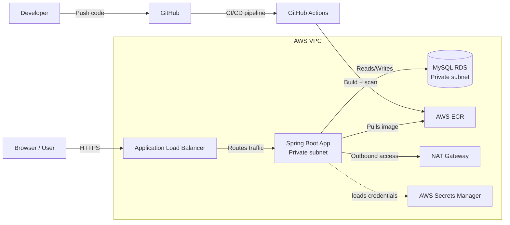
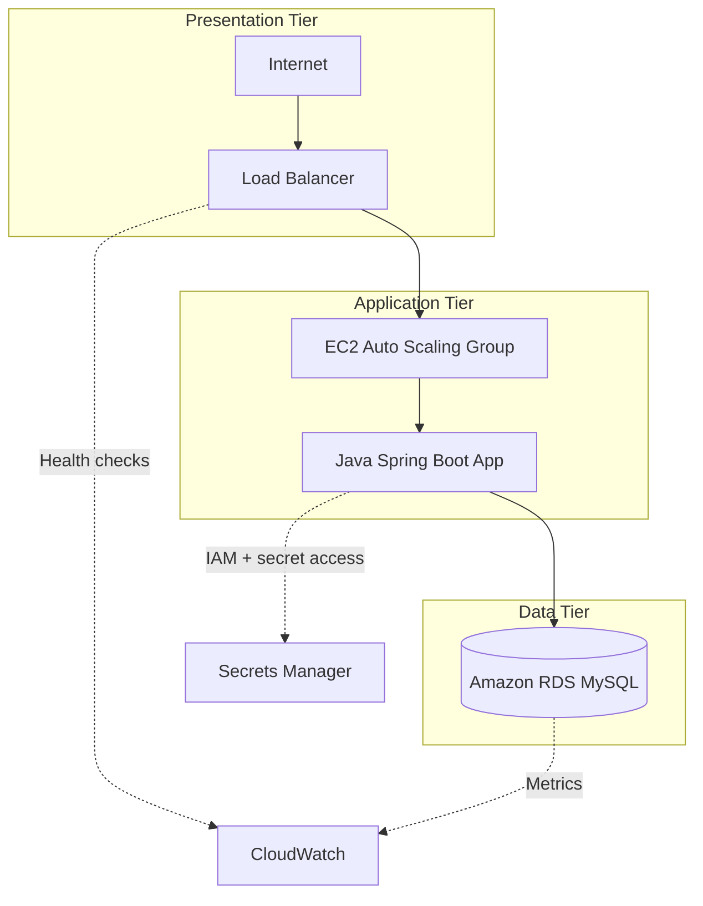
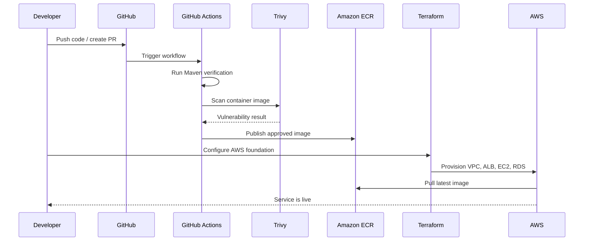
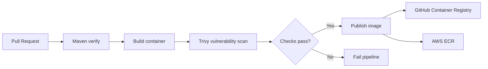

# Java AWS Three-Tier Platform


A production-style Java application running on AWS, built to demonstrate how a Spring Boot service, private database, and secure cloud infrastructure work together in a real-world three-tier architecture.

This repository is a hands-on reference project for developers, students, and cloud engineers who want to see how to combine:

- Java and Spring Boot application development
- Docker containerization
- Local development with Docker Compose
- Terraform-based AWS infrastructure provisioning
- GitHub Actions CI/CD automation
- Container vulnerability scanning with Trivy
- Secure deployment patterns in a private-network architecture

## Why this repository exists

This project shows the full journey of a cloud-native application:

1. Build a Java app locally
2. Run it with MySQL in Docker
3. Containerize it for deployment
4. Define AWS infrastructure in Terraform
5. Secure the platform with private networking and IAM
6. Validate and scan the image automatically
7. Deploy the release into a real AWS architecture

It is designed to be both educational and portfolio-friendly.

## Architecture at a glance



## Three-tier design



This is a classic three-tier architecture:

- Presentation layer: public entry point via ALB
- Application layer: Java app running privately on EC2
- Data layer: MySQL database in a private AWS subnet

## End-to-end delivery flow



## What the project includes

### Application layer
- Java 21
- Spring Boot
- Spring Security
- MySQL connectivity
- Flyway-based schema management

### Infrastructure layer
- Terraform for AWS networking and services
- Application Load Balancer
- EC2 Auto Scaling Group
- Private subnets for application and data tiers
- RDS for MySQL
- Secrets Manager and IAM-based access

### DevOps layer
- GitHub Actions workflow
- Maven verification
- Trivy vulnerability scanning
- Container image publishing
- Optional AWS rollout automation

## Local development

The project supports local testing and debugging with Docker Compose.

```bash
cp .env.example .env
bash scripts/run-local.sh
```

Then open:

- http://localhost:8080

This lets you run the app with MySQL locally before deploying to AWS.

## CI/CD workflow



The pipeline validates the code, scans the image for known security issues, and only publishes after the checks pass.

## Repository structure

```text
.
├── app/                     # Spring Boot application and Docker setup
├── infra/terraform/         # AWS infrastructure as code
├── scripts/                 # Local helper scripts
├── .github/workflows/       # CI/CD automation
├── docs/                   # Project documentation and assets
├── compose.yaml             # Local container orchestration
├── .env.example             # Environment variable template
├── README.md                # Project overview
├── .gitignore               # Git ignore rules
└── LICENSE                  # License (if present)
```

## Technologies used

- Java 21
- Maven
- Spring Boot
- Spring Security
- Docker
- Docker Compose
- MySQL
- Terraform
- AWS EC2, ALB, RDS, ECR, Secrets Manager
- GitHub Actions
- Trivy

## Who this is for

This repository is useful for:

- developers learning Java + AWS architectures
- students building cloud portfolio projects
- DevOps engineers learning Terraform patterns
- anyone exploring secure application deployment in AWS

## Quick summary

This project demonstrates a complete cloud application lifecycle:

- build the app
- run it locally
- containerize it
- secure the platform with AWS networking and IAM
- provision infrastructure using Terraform
- validate and scan the image
- deploy it into a production-like three-tier architecture

## Next steps

- Review the app instructions in `app/README.md`
- Review the AWS deployment guide in `infra/terraform/README.md`
- Configure local variables from `.env.example`
- Run the app locally
- Apply the Terraform stack in AWS

This repository is meant to be practical, educational, and easy to understand at a glance while still reflecting real-world cloud deployment patterns.

---

