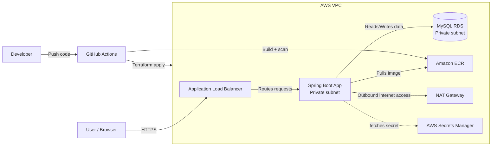
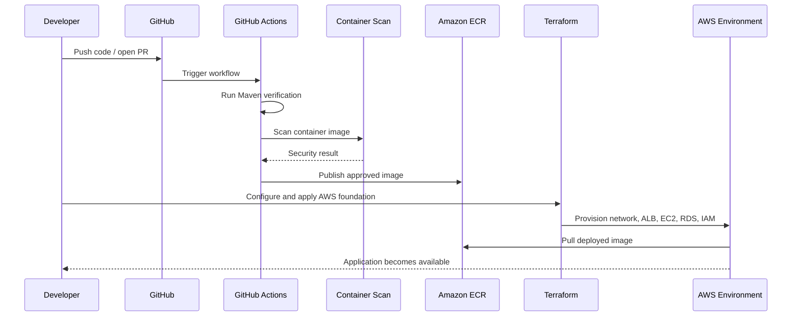
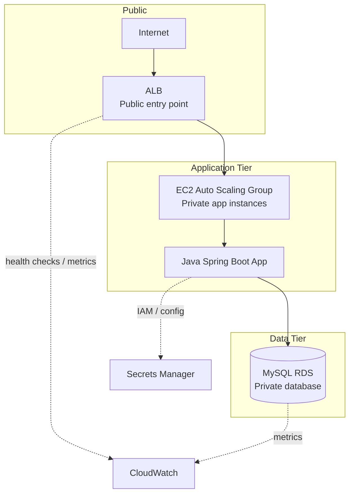
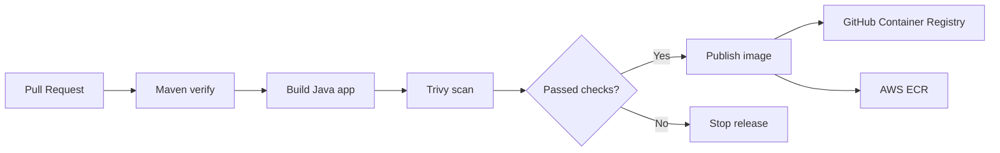

# Java AWS Three-Tier Platform

A full-stack demo project that shows how to build, containerize, secure, and deploy a Java Spring Boot application on AWS using Terraform, Docker, GitHub Actions, and production-style infrastructure patterns.

This repository is designed to help developers and cloud engineers understand how a real-world application can move from local development to a deployed three-tier architecture in AWS.

<p align="center">
  
</p>

> Note: if you do not add an image under `docs/assets/`, GitHub will still render the diagrams below. The project is intentionally described visually so viewers can understand the architecture quickly without reading the entire codebase first.

## What this repository is about

This project packages a Java-based access portal application into a container and deploys it across a protected AWS environment with:

- A public-facing load balancer
- A private application tier running on EC2
- A private MySQL database tier in RDS
- IaC with Terraform
- CI/CD automation with GitHub Actions
- Container image scanning and publishing
- Security-focused networking and IAM design

In simple terms, this repo demonstrates a production-style cloud architecture for hosting a Java app while keeping the database and app instances private and isolated.

## Why this project matters

This is not just a Hello World app. It is a reference architecture for:

- Java application development with Spring Boot
- Local containerized runs with Docker Compose
- Cloud infrastructure provisioning with Terraform
- Secure deployment patterns in AWS
- Automated checks before release
- Responsible delivery with vulnerability scanning

The goal is to show how application code and AWS infrastructure work together as a complete platform.

## Architecture overview



This diagram shows the core structure of the platform:

- The browser reaches the app through a public load balancer.
- The application and database are placed in private networking.
- Secrets are handled securely instead of being embedded in the app.
- The code is delivered through CI/CD into AWS-managed services.

## End-to-end delivery flow



This sequence describes the lifecycle from source code to deployed application.

## What the project includes

### Application layer
- Java 21 application
- Spring Boot backend
- Spring Security authentication
- MySQL database integration
- Flyway-based schema updates

### Platform and deployment layer
- Docker containerization
- Docker Compose for local development
- Terraform provisioning for AWS resources
- Application Load Balancer
- EC2 Auto Scaling Group
- Amazon RDS for MySQL
- Secrets Manager and IAM-based access

### DevOps layer
- GitHub Actions for CI
- Trivy vulnerability scanning
- Image publishing to container registries
- Optional AWS rollout automation

## Deployment topology



This architecture reflects a classic three-tier design:

1. Presentation layer: load balancer and public internet access
2. Application layer: Java app hosted on EC2 in private subnets
3. Data layer: database in private, isolated networking

## Local development workflow

The project supports local development using Docker Compose and scripts.

```bash
cp .env.example .env
bash scripts/run-local.sh
```

Then open:

- http://localhost:8080

This allows the Java app and MySQL database to run locally in a realistic setup before deploying to AWS.

## CI/CD and release flow



The workflow validates the code, scans the container for vulnerabilities, and only publishes an image if the checks pass. This gives the project a safer release lifecycle than pushing a container blindly.

## Repository structure

```text
.
├── app/                     # Java Spring Boot application
├── infra/terraform/         # AWS infrastructure definitions
├── scripts/                 # Local automation scripts
├── .github/workflows/       # CI/CD automation
├── docs/                    # Portfolio evidence and supporting docs
├── compose.yaml             # Local compose setup
├── .env.example             # Example environment variables
├── README.md                # Project overview
├── pom.xml                  # Java build config (inside app/)
└── LICENSE                  # If present in your repo
```

## Technologies used

- Java 21
- Spring Boot
- Spring Security
- Maven
- Docker / Docker Compose
- MySQL
- Terraform
- AWS EC2, RDS, ECR, ALB, Secrets Manager
- GitHub Actions
- Trivy

## Who is this for?

This repository is useful for:

- Developers learning cloud-native Java deployment
- Students building AWS portfolio projects
- DevOps engineers learning Terraform + AWS service wiring
- Anyone exploring secure architecture patterns for real applications

## Quick summary

This repo demonstrates a complete cloud application lifecycle:

- Build a Java app
- Run it locally with containers
- Secure the environment with AWS networking and IAM
- Define infrastructure as code with Terraform
- Validate and scan the image automatically
- Deploy it to a three-tier AWS architecture

That combination makes it an excellent example of modern application delivery in a cloud-first environment.

## Next steps

- Read the app details in `app/README.md`
- Review the AWS deployment guide in `infra/terraform/README.md`
- Configure your local environment with `.env`
- Run the app locally
- Apply the Terraform foundation in AWS

This repository is meant to be both understandable and practical: it shows the full picture of a Java application deployed in AWS without hiding the infrastructure decisions behind abstraction.

---

If you want, I can also turn this into a more polished portfolio-style README with badges, screenshots, and a stronger “demo-ready” landing page layout.
