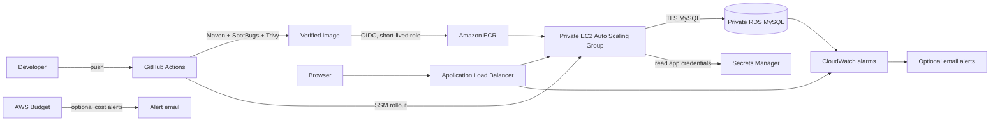

# Java Login on AWS: Three-Tier Portfolio Project

An independent, hands-on implementation of a Java application deployed on AWS. The project is being built incrementally to demonstrate application delivery, infrastructure as code, CI/CD, security, and operations.

## Inspiration and attribution

This is an independently authored application and deployment platform, inspired by the Java login and three-tier AWS exercise in [NotHarshhaa/DevOps-Projects, Project 1](https://github.com/NotHarshhaa/DevOps-Projects/tree/master/DevOps-Project-01). The app implementation in this repository is a fresh rewrite; the reference is credited for the learning direction and architecture idea.

## Current status

The independently written Spring Boot app has Spring Security sign-in, BCrypt password hashes, JDBC-backed users, a Flyway-managed MySQL schema, and environment-based database configuration. The app has a multi-stage, non-root Docker image and local Trivy scanning. GitHub Actions runs Maven verification and SpotBugs, scans the built image, and publishes the same scanned image to GHCR and ECR on successful pushes to `main`. Terraform defines the AWS network, public load balancer, private EC2 Auto Scaling Group, isolated RDS MySQL instance, GitHub OIDC release role, and an immutable-tag ECR repository in [infra/terraform](infra/terraform). The EC2 launch template installs Docker, pulls the latest scanned image, and reads only the dedicated app database secret at boot. The app group remains at zero until the database user and secret are configured. The infrastructure also defines CloudWatch operational alarms, optional email and monthly budget notifications, and ECR image retention.

## Architecture

## Tooling demonstrated

| Area | Tools and practices |
| --- | --- |
| Application | Java, Spring Boot, Spring Security, JDBC, Flyway, MySQL |
| Build and quality | Maven, GitHub Actions, SpotBugs |
| Containers and supply chain | Docker multi-stage build, non-root runtime, Trivy, GHCR, Amazon ECR |
| AWS infrastructure | Terraform, VPC, ALB, EC2 Auto Scaling, RDS, Secrets Manager, IAM |
| Delivery and operations | GitHub OIDC, Systems Manager, CloudWatch alarms, AWS Budgets |

See [portfolio evidence](docs/portfolio-evidence.md) for a checklist of real deployment screenshots and safe sharing practices.

## Planned milestones

1. Establish the independent repository and document its inspiration.
2. Build the original Java access portal with secure database-backed sign-in.
3. Add a reproducible local MySQL environment and run instructions.
4. Create the AWS network and least-privilege security boundaries in Terraform.
5. Add the application tier, load balancer, and private database foundation in Terraform; container bootstrap follows.
6. Package the application with Docker and add image security checks. Local image build and Trivy scan commands are available.
7. Add Maven CI, code-quality analysis, and artifact publishing. (GitHub Actions, SpotBugs, Trivy, and GHCR delivery are configured.)
8. Add short-lived GitHub OIDC access and publish scanned images to ECR. (OIDC trust, least-privilege ECR publishing, and the workflow are configured; AWS resource creation and repository variables remain an operator step.)
9. Bootstrap the private EC2 tier with the container and a dedicated database secret. (Terraform and startup configuration are in place; the database user and secret value must be provisioned before scaling above zero.)
10. Add a controlled rolling deployment for new ECR images. (GitHub Actions uses a fixed SSM command to restart app-tagged instances one at a time and checks health before it proceeds.)
11. Add operational monitoring, cost notifications, image retention, teardown guidance, and portfolio evidence. (Terraform includes four CloudWatch alarms, optional email and budget notifications, and an ECR lifecycle policy. Deployment remains an operator action.)

## Security

Never commit AWS credentials, database passwords, access tokens, Terraform state, or generated environment files. Use environment variables or a managed secret store for runtime configuration. Review the project before deploying to an AWS account and destroy demonstration resources when they are no longer needed.
